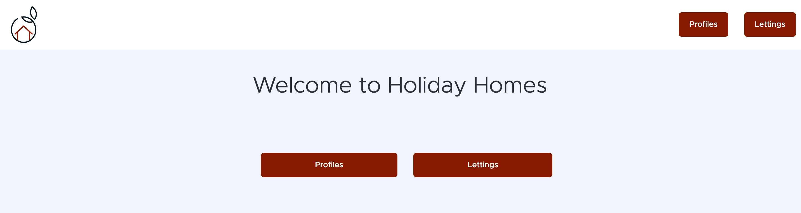
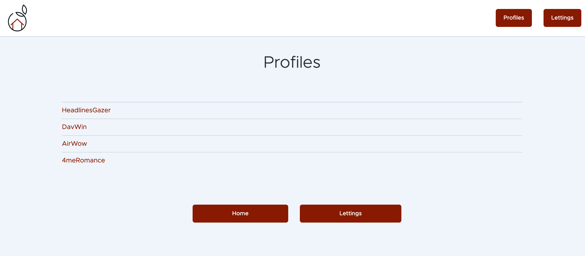
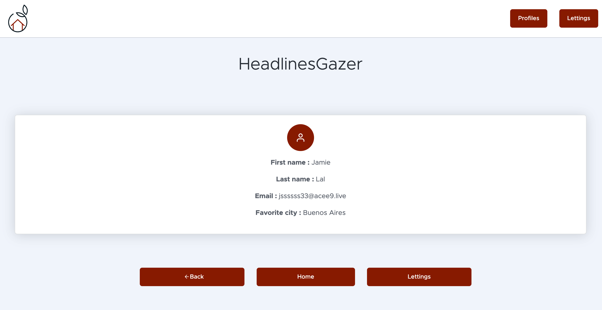
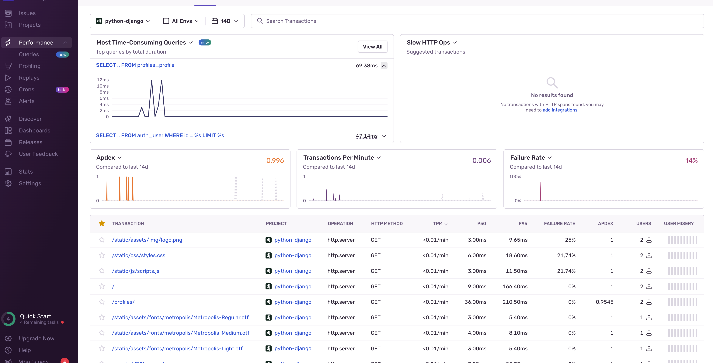
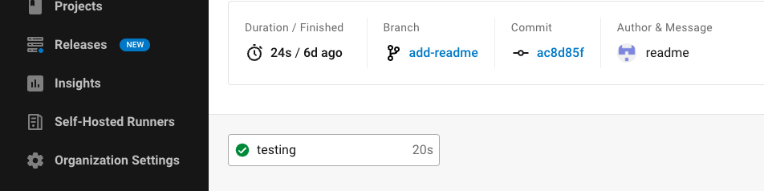

====================
Guide d'utilisation
====================

.

.. _les langages et technologies: technologies-et-langages.html

.. _projet clôné: installation.html

.. _l'environnement virtuel: guide-de-demarrage-rapide.html

.. _le serveur: guide-de-demarrage-rapide.html

.. _.env: guide-de-demarrage-rapide.html

.. note::

    Les installations sont nécessaires:

    - `les langages et technologies`_ du projet.

    - `projet clôné`_ dans votre ordinateur

    - `l'environnement virtuel`_ , le requirements.txt et .env installés

Sur web
^^^^^^^^

Lorsque `le serveur`_ est lancé, vous allez voir la page d'accueil avec 2 choix affichés

Lorque vous choissisez le boutons Profiles, le serveur va lancer une requête de Profile dans la base de données pour tous récupérer et renvoyer la liste montrant en font-end.

Lorsque vous être dans la page de profile et que vous cliquez sur un profile au hazard, le serveur va lancer une requête de Profile avec Profile Id dans la base de donnée, ensuite retourner le résultat vers api enpoint de profile name.

Sentry
^^^^^^^

Lorsque le serveur est lancé et DSN de Sentry est correctement ajouter dans le fichier `.env`_, vous pouvez allers l'interface Sentry pour surveiller les transactions, performance et erreurs.

CircleCI
^^^^^^^^

Lorsque vous créer et lancé une commit sur votre branch de developement, les test vont êtes lancé automatiquement avec CircleCI.

Lorsque vous mergez la branch developement à la branch master (main), CircleCI va lancer automatiquement la créations de image, pousser sur DockerHub et deployer le projet dans AWS EC2 instance.

.. image:: _static/circle2.png
    :alt: circle completely
    :width: 100%

