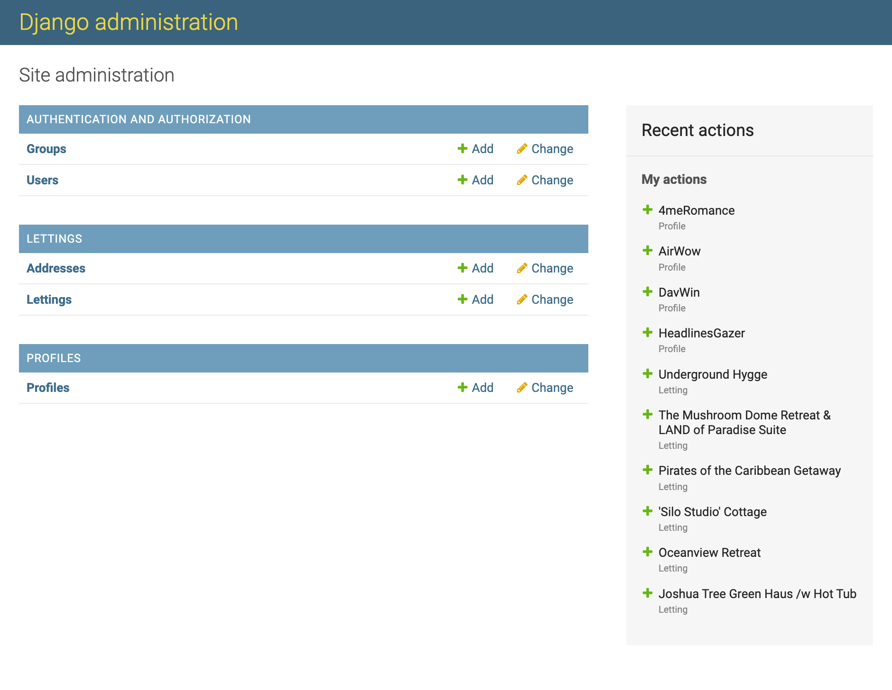

============================================
Description des interfaces de programmation
============================================

.

L'interface d'administration
^^^^^^^^^^^^^^^^^^^^^^^^^^^^^

De base, Django nous simplifie la vie de vous propose de réserver une partie de notre projet pour consulter et éditer les entrées de données, me Django admin peut utiliser les models et construire automatically une interface où nous pouvons Create ( Créer), Read ( Lire), Update (Modifier), Delete (Supprimer).

L'interface d'administration est accessible en pointant vers /admin:
 
 Username: admin

 Password: Abc1234!

.

Interface du site Django
^^^^^^^^^^^^^^^^^^^^^^^^^

*Page d'acceuil du site*

.. image:: _static/homepage.png
    :alt: admin
    :width: 100%

Avec le design pattern MVT( Modèles, View, Templates), Django nous permets de créer une interface structurer.

*Commence par définir les modèles pour les données*

.. code-block:: python

    class Address(models.Model):
    """
    Model with:
    number = int
    street =str
    city=str
    state=str
    zip_code=int
    country_is_code=str
    """

    number = models.PositiveIntegerField(validators=[MaxValueValidator(9999)])
    street = models.CharField(max_length=64)
    city = models.CharField(max_length=64)
    state = models.CharField(max_length=2, validators=[MinLengthValidator(2)])
    zip_code = models.PositiveIntegerField(validators=[MaxValueValidator(99999)])
    country_iso_code = models.CharField(
        max_length=3, validators=[MinLengthValidator(3)]
    )

    def __str__(self):
        return f"{self.number} {self.street}"

    class Meta:
        # Change the model name when plural
        verbose_name_plural = "Addresses"

    class Letting(models.Model):
    """
    title=str
    address=1 to many relation, FK
    """

    title = models.CharField(max_length=256)
    address = models.OneToOneField(Address, on_delete=models.CASCADE)

    def __str__(self):
        return self.title

*Création des templates en HTML , CSS, Bootstrap:*

.. code-block:: html

    <!DOCTYPE html>
    

    <html lang="en">

    <head>
        <meta charset="utf-8" />
        <meta http-equiv="X-UA-Compatible" content="IE=edge" />
        <meta name="viewport" content="width=device-width, initial-scale=1, shrink-to-fit=no" />
        <meta name="description" content="" />
        <meta name="author" content="" />
        <title></title>
        <link href="" rel="stylesheet" />
        <link rel="stylesheet" href="https://unpkg.com/aos@next/dist/aos.css" />
        <link rel="icon" type="image/x-icon" href="" />
        
        
    </head>

    <body>
        

            

                <main>
                    <!-- Navbar-->
                    <nav class="navbar  navbar-expand-lg bg-white navbar-light">
                        

                            
                            

                                <a class="btn fw-500 ms-lg-4 btn-primary" href="">
                                    Profiles
                                </a>
                                <a class="btn fw-500 ms-lg-4 btn-primary" href="">
                                    Lettings
                                </a>
                            

                        

                    </nav>
                    

                    
                </main>
            

            

                <footer class="footer pb-5 mt-auto bg-dark footer-dark">
                    

                        

                        

                            
Copyright &copy; Orange County Lettings 2023

                            

                                <a href="#!">Privacy Policy</a>
                                &middot;
                                <a href="#!">Terms &amp; Conditions</a>
                            

                        

                    

                </footer>
            

        

        
        
        
        
    </body>

    </html>

*Puisse créer des functions interactions dans views:*

.. code-block:: python

    def index(request):
        """
        Show list of lettings
        :param request from user
        :return list of letting
        """
        lettings_list = Letting.objects.all()
        context = {"lettings_list": lettings_list}
        return render(request, "lettings/index.html", context)

    def letting(request, letting_id):
        """
        Show a letting
        :params request and letting_id
        :return letting details
        """
        letting = get_object_or_404(Letting, id=letting_id)
        context = {
            "title": letting.title,
            "address": letting.address,
        }
        return render(request, "lettings/letting.html", context)

*En fin ajouter les endpoints API:*

.. code-block:: python

    from django.urls import path

    from .views import index, letting

    app_name = "lettings"

    urlpatterns = [
        path("lettings/", index, name="index"),
        path("lettings/<int:letting_id>/", letting, name="letting"),
    ]

